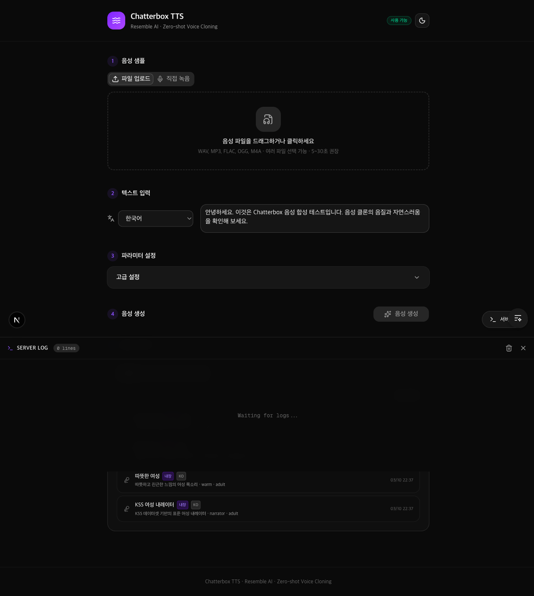
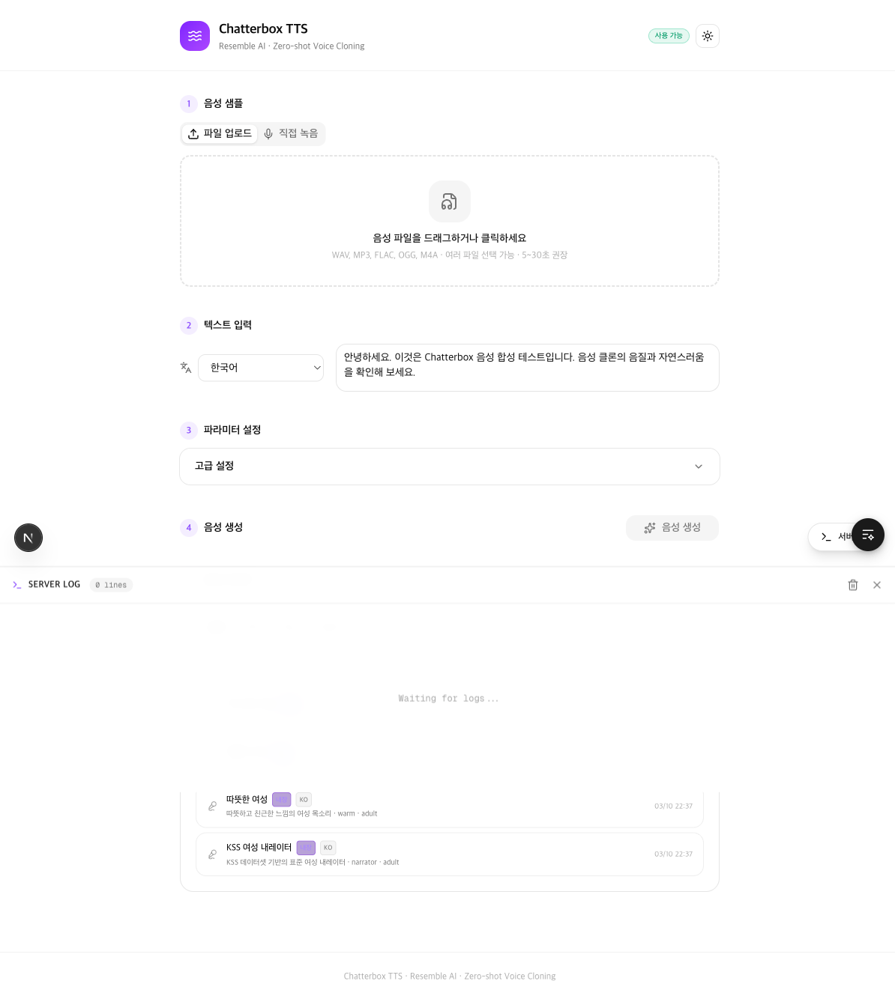

# 음성 클론 (Voice Clone)

**Chatterbox TTS + Fish Speech S2 기반 Zero-shot Voice Cloning 웹 애플리케이션**

음성 파일 하나(15초)만으로 누구의 목소리든 복제하고, 텍스트를 입력하면 해당 목소리로 즉시 음성을 생성합니다. 클론한 목소리의 속도와 음정을 조정해 여러 개의 음성 페르소나를 만들 수 있고, 프리셋 시스템으로 한번 클론한 목소리를 저장해 반복 사용할 수 있습니다.




---

## 핵심 기능

### 1. **Zero-shot Voice Cloning** (무제한 음성 생성)
- 별도 학습 없이 15초 분량의 음성 샘플 하나로 즉시 목소리 복제
- 복제 후 텍스트만 바꿔가며 무제한으로 음성 생성
- Chatterbox: 15개 언어 / Fish Speech S2: 47개 언어 지원

### 2. **음성 컨셉 (Voice Concept)** - NEW
- **속도 조정**: 0.5배 ~ 2.0배로 음성 속도 변경
- **음정 조정**: -12 ~ +12 반음으로 음정 변경
- 한 번 클론한 목소리에서 속도와 음정만 조정해 여러 페르소나 생성
- 예: 차분한 음성(느린 속도, 낮은 음정) vs 생기 있는 음성(빠른 속도, 높은 음정)

### 3. **음역대 분석 (Vocal Range Analysis)** - NEW
- 업로드한 음성 파일의 음역대 자동 분석
- 음역대에 맞는 성악 분류 (베이스, 바리톤, 테너, 알토, 메조소프라노, 소프라노)
- **추천 곡 제시**: 당신의 음역대에 맞는 노래 추천 (한국곡, 영어곡)
- 난이도 평가 (쉬움/보통/도전) 및 키 조정 제안

### 4. **프리셋 시스템** (음성 저장 및 재사용)
- 클론한 음성을 프리셋으로 저장 → 이름 붙여서 관리
- 14개 빌트인 프리셋 제공 (한국어 KSS, 영어 VCTK/LJ Speech 등)
- 프리셋 로드 시 자동 재생 및 텍스트 입력 자동 포커스

### 5. **스트리밍 생성** (실시간 재생)
- 긴 텍스트를 문장 단위로 자동 분리
- 각 문장을 순차적으로 생성하고 즉시 재생
- 진행률 표시 및 중간 중단 가능

### 6. **텍스트 큐** (배치 처리)
- 여러 텍스트를 큐에 추가하고 한 번에 생성 처리
- 각 항목별 상태 표시 (대기 중 / 생성 중 / 완료 / 오류)
- 개별 재생 지원

### 7. **Apple Silicon 네이티브** (M1/M2/M3/M4 Mac 최적화)
- MPS 백엔드로 Mac GPU 가속 동작
- NVIDIA GPU 환경도 지원 (CUDA)

---

## 기술 스택

### Backend

| 기술 | 버전 | 용도 |
|---|---|---|
| **Python** | 3.11+ | 런타임 |
| **FastAPI** | 0.115+ | REST API 서버 |
| **Uvicorn** | 0.34+ | ASGI 서버 |
| **Chatterbox TTS** | latest | Resemble AI의 Zero-shot Voice Cloning 엔진 (로컬, MPS/CUDA/CPU) |
| **Fish Speech S2** | latest | Fish Audio의 Dual-AR TTS 엔진 (원격 API, CUDA 필수) |
| **PyTorch** | 2.x | 딥러닝 프레임워크 (MPS/CUDA/CPU 지원) |
| **torchaudio** | 2.x | 오디오 처리, 피치 분석, 속도 조정 |
| **Pydantic** | 2.10+ | 요청/응답 스키마 검증 |
| **SSE-Starlette** | — | Server-Sent Events (실시간 로그 스트리밍) |
| **aiofiles** | 24.1+ | 비동기 파일 I/O |

### Frontend

| 기술 | 버전 | 용도 |
|---|---|---|
| **Next.js** | 16+ | React 프레임워크 (App Router) |
| **React** | 19+ | UI 라이브러리 |
| **TypeScript** | 5.x | 타입 안전성 |
| **Tailwind CSS** | 4.x | 유틸리티 기반 스타일링 |
| **shadcn/ui** | 4.0+ | UI 컴포넌트 라이브러리 |
| **next-themes** | 0.4+ | 다크/라이트 모드 |
| **Lucide React** | 0.577+ | 아이콘 |

### 배포

| 기술 | 용도 |
|---|---|
| **Docker** | 컨테이너화 배포 |
| **Docker Compose** | 멀티 서비스 오케스트레이션 |

---

## 프로젝트 구조

```
voice-clone/
├── backend/
│   ├── app/
│   │   ├── main.py                  # FastAPI 앱, CORS, SSE 로그 스트림
│   │   ├── config.py                # 경로, 업로드 제한, 샘플레이트 설정
│   │   ├── schemas.py               # Pydantic 요청/응답 모델
│   │   ├── log_stream.py            # LogBuffer, SSE 구독, stdout/stderr 캡처
│   │   ├── engines/
│   │   │   ├── base.py              # TTSEngine 추상 클래스
│   │   │   ├── chatterbox_engine.py # Chatterbox 엔진 (음성 임베딩, 속도/음정 조정)
│   │   │   └── fish_speech_engine.py # Fish Audio S2 엔진 (선택, CUDA 서버 필요)
│   │   └── routers/
│   │       ├── tts.py               # TTS API 엔드포인트
│   │       └── vocal.py             # 음역대 분석 및 곡 추천 엔드포인트
│   ├── scripts/
│   │   ├── generate_presets.py      # 빌트인 프리셋 일괄 생성 CLI
│   │   ├── preset_manifest.json     # 14개 프리셋 메타데이터
│   │   └── PRESET_GUIDE.md          # 프리셋 큐레이션 가이드
│   ├── curated_clips/               # 프리셋 생성용 WAV 클립 (gitignore)
│   ├── voice_presets/               # 생성된 프리셋 파일 (.pt + .json)
│   ├── uploads/                     # 업로드된 음성 파일 (런타임)
│   ├── outputs/                     # 생성된 TTS 오디오 (런타임)
│   └── requirements.txt             # Python 의존성
│
├── frontend/
│   ├── src/
│   │   ├── app/
│   │   │   ├── page.tsx             # 메인 페이지
│   │   │   ├── layout.tsx           # ThemeProvider, TooltipProvider
│   │   │   └── globals.css          # CSS 변수, 스크롤바 테마
│   │   ├── components/
│   │   │   ├── VoiceUploader.tsx     # 파일 업로드 + 브라우저 녹음
│   │   │   ├── VoicePresetPanel.tsx  # 프리셋 목록/로드/저장/삭제
│   │   │   ├── ParamsPanel.tsx       # 속도/음정 및 기타 파라미터 슬라이더
│   │   │   ├── VocalAnalysisPanel.tsx # 음역대 분석 + 곡 추천
│   │   │   ├── AudioPlayer.tsx       # 오디오 재생기
│   │   │   ├── ServerLogModal.tsx    # 서버 로그 뷰어 (SSE)
│   │   │   ├── mode-toggle.tsx       # 다크/라이트 모드 토글
│   │   │   └── ui/                   # shadcn/ui 컴포넌트
│   │   └── lib/
│   │       ├── api.ts               # 백엔드 API 함수
│   │       ├── types.ts             # TypeScript 인터페이스
│   │       ├── utils.ts             # 유틸리티
│   │       └── split-sentences.ts   # 문장 분리기
│   ├── components.json              # shadcn/ui 설정
│   └── package.json
│
├── docker-compose.yml               # Docker 오케스트레이션
├── Dockerfile.backend               # 백엔드 Docker 이미지
└── README.md
```

---

## 설치 및 실행 (macOS Apple Silicon 기준)

### 1단계: 저장소 클론

```bash
git clone https://github.com/flykimjiwon/voice-clone.git
cd voice-clone
```

### 2단계: 백엔드 설정

```bash
cd backend

# 가상환경 생성 및 활성화
python3.11 -m venv venv
source venv/bin/activate

# 기본 의존성 설치
pip install -r requirements.txt

# Chatterbox TTS 설치
pip install chatterbox-tts

# PyTorch (Apple Silicon M1/M2/M3/M4 Mac)
pip install torch torchaudio

# PyTorch (NVIDIA GPU Linux) - 선택
# pip install torch torchaudio --index-url https://download.pytorch.org/whl/cu121
```

### 3단계: 프론트엔드 설정

```bash
cd frontend

# 의존성 설치
npm install

# 개발 빌드 확인
npm run build
```

### 4단계: 실행

**터미널 1 — 백엔드 서버:**

```bash
cd backend
source venv/bin/activate
COQUI_TOS_AGREED=1 PYTORCH_ENABLE_MPS_FALLBACK=1 \
  uvicorn app.main:app --host 0.0.0.0 --port 8000 --reload
```

> 첫 실행 시 Chatterbox 모델(약 2GB)이 자동으로 다운로드됩니다.

**터미널 2 — 프론트엔드 서버:**

```bash
cd frontend
npm run dev
```

**브라우저에서 열기:** http://localhost:3000

### 5단계: Docker로 실행 (선택)

```bash
docker-compose up --build
```

---

## 사용 방법

### 프리셋으로 즉시 생성 (가장 간단한 방법)

1. **음성 프리셋** 탭에서 원하는 프리셋 선택 → "로드" 클릭
2. 텍스트 입력 영역에 텍스트 입력
3. "음성 생성" 클릭 또는 `⌘+Enter` (Mac) / `Ctrl+Enter` (Windows/Linux)
4. 자동으로 음성이 생성되고 즉시 재생됩니다

### 새 음성으로 클론 + 생성

1. **새 음성 추가** 섹션에서:
   - 음성 파일 업로드 (WAV, MP3, FLAC, OGG, M4A, WebM)
   - 또는 마이크로 직접 녹음 (15초 이상)
2. 텍스트 입력
3. "음성 생성" 클릭
4. 결과가 마음에 들면 → **프리셋 저장** 버튼으로 이름 붙여 저장

### 음성 컨셉으로 페르소나 만들기

1. 음성을 한 번 클론합니다
2. **파라미터** 섹션에서:
   - **속도**: 0.5배(느린 목소리) ~ 2.0배(빠른 목소리)
   - **음정**: -12반음(낮은 톤) ~ +12반음(높은 톤)
3. 같은 음성인데 다른 성격의 목소리를 만들 수 있습니다

### 음역대 분석하고 부를 노래 찾기

1. 음성을 업로드합니다
2. **음역대 분석** 섹션에서 "내 음역대 분석하기" 클릭
3. 자동으로 분석되며:
   - 당신의 최저음, 최고음, 범위(반음/옥타브)
   - 성악 분류 (베이스/바리톤/테너/알토/메조소프라노/소프라노)
   - 추천 곡 목록 (당신의 음역대에 맞는 곡들)
   - 각 곡별 난이도 및 키 조정 제안

### 스트리밍 모드 (자동 활성화)

텍스트가 2문장 이상이면 자동으로 **스트리밍 모드** 활성화:
- 문장 단위로 순차 생성 + 즉시 재생
- 진행률 표시 및 중단 가능

### 텍스트 큐로 여러 텍스트 배치 처리

1. **텍스트 큐** 섹션에서 여러 텍스트 추가
2. "전체 생성" 버튼으로 배치 처리
3. 각 항목별 상태 표시 및 개별 재생

### 언어 선택

언어 드롭다운에서 한국어, 영어, 중국어, 일본어 등 23개 언어 중 선택 후 합성합니다.

---

## API 엔드포인트

### 엔진 상태

| Method | Endpoint | 설명 |
|---|---|---|
| `GET` | `/health` | 서버 상태 확인 |
| `GET` | `/api/engines` | 모든 엔진 상태 조회 |
| `GET` | `/api/engine` | 단일 엔진 상태 (`?engine_id=chatterbox`) |

### 음성 처리

| Method | Endpoint | 설명 |
|---|---|---|
| `POST` | `/api/upload-voice` | 음성 파일 업로드 (WAV, MP3, FLAC, OGG, M4A, WebM) |
| `POST` | `/api/prepare-voice` | 음성 임베딩 사전 준비 |
| `POST` | `/api/synthesize` | 텍스트 → 음성 합성 |
| `GET` | `/api/audio/{filename}` | 생성된 오디오 파일 다운로드 |

### 프리셋 관리

| Method | Endpoint | 설명 |
|---|---|---|
| `GET` | `/api/voice-presets` | 프리셋 목록 조회 (`?gender=`, `?language=` 필터) |
| `POST` | `/api/voice-presets` | 현재 음성으로 프리셋 저장 |
| `POST` | `/api/voice-presets/{id}/load` | 프리셋 로드 (임베딩 적용) |
| `DELETE` | `/api/voice-presets/{id}` | 프리셋 삭제 (빌트인은 403 Forbidden) |

### 음역대 분석 및 곡 추천 (NEW)

| Method | Endpoint | 설명 |
|---|---|---|
| `GET` | `/api/vocal/analyze` | 음역대 분석 (`?voice_id=` 또는 `?preset_id=`) |
| `GET` | `/api/vocal/songs` | 곡 추천 (`?low_hz=`, `?high_hz=`, `?language=`) |

### 로그 스트리밍

| Method | Endpoint | 설명 |
|---|---|---|
| `GET` | `/api/logs/stream` | SSE 실시간 로그 스트림 |
| `GET` | `/api/logs/recent` | 최근 로그 조회 (`?n=50`) |

---

## 음성 합성 파라미터

### 기본 파라미터 (Chatterbox)

| 파라미터 | 기본값 | 범위 | 설명 |
|---|---|---|---|
| `exaggeration` | 0.5 | 0.0 ~ 2.0 | 음성 특징 강조 정도 (낮을수록 평탄, 높을수록 극적) |
| `cfg_weight` | 0.5 | 0.0 ~ 1.0 | Classifier-free Guidance 가중치 |
| `temperature` | 0.8 | 0.1 ~ 2.0 | 생성 다양성 (낮을수록 일관적, 높을수록 다양) |
| `repetition_penalty` | 2.0 | 1.0 ~ 5.0 | 반복 억제 강도 |
| `min_p` | 0.05 | 0.0 ~ 0.5 | 최소 확률 필터링 |
| `top_p` | 1.0 | 0.1 ~ 1.0 | Nucleus 샘플링 |

### 음성 컨셉 파라미터 (Voice Concept)

| 파라미터 | 기본값 | 범위 | 설명 |
|---|---|---|---|
| `speed` | 1.0 | 0.5 ~ 2.0 | 음성 속도 (0.5배 느림 ~ 2.0배 빠름) |
| `pitch_semitones` | 0 | -12 ~ +12 | 음정 변경 (반음 단위) |

> 팁: 속도와 음정을 조합하면 다양한 음성 페르소나를 만들 수 있습니다.
> - 낮은 음정 + 느린 속도 = 차분하고 진중한 목소리
> - 높은 음정 + 빠른 속도 = 생기 있고 밝은 목소리

---

## 빌트인 프리셋

### 14개 기본 프리셋

| 이름 | 성별 | 언어 | 소스 |
|---|---|---|---|
| KSS 여성 내레이터 | 여성 | 한국어 | KSS 데이터셋 |
| 따뜻한 여성 | 여성 | 한국어 | KSS 데이터셋 |
| 또렷한 여성 | 여성 | 한국어 | KSS 데이터셋 |
| 부드러운 여성 | 여성 | 한국어 | KSS 데이터셋 |
| Female Announcer | 여성 | 영어 | VCTK p225 |
| Female Narrator | 여성 | 영어 | VCTK p226 |
| Warm Female Voice | 여성 | 영어 | LJ Speech |
| Calm Female Voice | 여성 | 영어 | LibriSpeech |
| Expressive Female Voice | 여성 | 영어 | Common Voice |
| Male Announcer | 남성 | 영어 | VCTK |
| Male Narrator | 남성 | 영어 | VCTK p227 |
| Deep Male Voice | 남성 | 영어 | LibriSpeech |
| Male Newsreader | 남성 | 영어 | LibriSpeech |
| Documentary Male Voice | 남성 | 영어 | Common Voice |

### 커스텀 프리셋 생성

```bash
cd backend
source venv/bin/activate

# curated_clips/ 디렉토리에 WAV 파일 배치 후:
COQUI_TOS_AGREED=1 PYTORCH_ENABLE_MPS_FALLBACK=1 python -m scripts.generate_presets \
  --manifest scripts/preset_manifest.json \
  --input-dir ./curated_clips \
  --exaggeration 0.5 \
  --no-preview
```

---

## 환경 변수

### 필수 환경 변수

| 변수 | 기본값 | 설명 |
|---|---|---|
| `COQUI_TOS_AGREED` | — | `1`로 설정 (Coqui TTS 라이선스 동의) |
| `PYTORCH_ENABLE_MPS_FALLBACK` | — | `1`로 설정 (Apple Silicon MPS 폴백) |

### 선택 환경 변수

| 변수 | 기본값 | 설명 |
|---|---|---|
| `NEXT_PUBLIC_API_URL` | `http://localhost:8000` | 백엔드 API URL |
| `FISH_SPEECH_URL` | `http://localhost:8080` | Fish Audio S2 서버 URL (선택) |

---

## 하드웨어 호환성

| 환경 | 지원 | 성능 | 비고 |
|---|---|---|---|
| Apple Silicon (M1/M2/M3/M4) | ✅ | 중상 | MPS 백엔드, CUDA 대비 2~5x 느림 |
| NVIDIA GPU (CUDA) | ✅ | 최고 | 최적 성능 |
| CPU Only | ✅ | 저 | 매우 느림 (비권장) |
| Intel Mac | ⚠️ | 저 | CPU 모드로 동작, 매우 느림 |

---

## 지원 언어

### Chatterbox TTS (15개 언어)
- **아시아**: 한국어, 중국어, 일본어
- **유럽**: 영어, 스페인어, 프랑스어, 독일어, 이탈리아어, 포르투갈어, 폴란드어, 네덜란드어, 터키어
- **기타**: 러시아어, 아랍어, 힌디어

### Fish Speech S2 (47개 언어)
위 15개 + 스웨덴어, 덴마크어, 핀란드어, 그리스어, 히브리어, 말레이어, 노르웨이어, 스와힐리어, 우크라이나어, 체코어, 루마니아어, 헝가리어, 인도네시아어, 베트남어, 태국어 등

---

## 트러블슈팅

### 문제: 백엔드 서버에 연결할 수 없습니다

**원인**: 백엔드 서버가 실행 중이 아닙니다.

**해결책**:
```bash
# 백엔드가 제대로 실행 중인지 확인
curl http://localhost:8000/health

# 또는 터미널에서 다시 시작
cd backend
source venv/bin/activate
COQUI_TOS_AGREED=1 PYTORCH_ENABLE_MPS_FALLBACK=1 \
  uvicorn app.main:app --host 0.0.0.0 --port 8000 --reload
```

### 문제: "음성에서 피치를 감지할 수 없습니다"

**원인**: 업로드한 음성이 너무 짧거나 음성이 제대로 감지되지 않습니다.

**해결책**:
- 최소 15초 이상의 음성 파일 업로드
- 명확하고 깨끗한 음성 사용 (잡음이 많으면 안 됨)
- WAV 형식 권장

### 문제: 프론트엔드 빌드 오류

**원인**: Node.js 버전 호환성 문제 또는 의존성 문제

**해결책**:
```bash
cd frontend
rm -rf node_modules package-lock.json
npm install
npm run build
```

### 문제: 속도가 너무 느립니다

**원인**: CPU만으로 동작 중이거나 MPS가 활성화되지 않음

**해결책**:
```bash
# Apple Silicon이면 MPS 확인
python -c "import torch; print(torch.backends.mps.is_available())"

# MPS 폴백 활성화 (이미 설정됨)
export PYTORCH_ENABLE_MPS_FALLBACK=1
```

---

## 고급 기능

### Fish Audio S2 엔진 사용

Fish Audio S2 엔진을 사용하면 더 빠른 생성 속도와 47개 언어를 지원합니다 (CUDA 필수).

**Docker Compose로 실행 (권장):**
```bash
docker-compose up --build
# fish-speech 서버가 자동으로 8080에서 시작됩니다
```

**수동 설정:**
```bash
# 1. 모델 다운로드
huggingface-cli download fishaudio/s2-pro --local-dir checkpoints/s2-pro

# 2. Fish Speech 서버 실행
python tools/api_server.py \
  --llama-checkpoint-path checkpoints/s2-pro \
  --decoder-checkpoint-path checkpoints/s2-pro/codec.pth \
  --listen 0.0.0.0:8080

# 3. 백엔드에 URL 설정
export FISH_SPEECH_URL=http://localhost:8080
```

프론트엔드에서 엔진 드롭다운으로 "Fish Audio S2" 선택 가능합니다.

### 로그 실시간 확인

"서버 로그" 탭에서 음성 생성 중 실시간 로그를 확인할 수 있습니다. Server-Sent Events (SSE)를 통해 스트리밍됩니다.

---

## 라이선스

이 프로젝트는 개인 학습 및 연구 목적으로 제작되었습니다.

- **Chatterbox TTS**: [Resemble AI License](https://github.com/resemble-ai/chatterbox)
- **KSS Dataset**: [CC BY 4.0](https://www.kaggle.com/datasets/bryanpark/korean-single-speaker-speech-dataset)
- **LJ Speech**: Public Domain
- **LibriSpeech**: CC BY 4.0
- **Common Voice**: CC-0

---

## 기여 및 피드백

버그 리포트, 기능 제안, PR은 언제나 환영합니다.

---

## 버전 히스토리

### v2.0.0 (현재)
- 음성 컨셉 (속도/음정 조정) 추가
- 음역대 분석 및 곡 추천 기능 추가
- Fish Audio S2 엔진 지원
- UI/UX 개선 (자동 재생, 자동 포커스 등)

### v1.0.0
- 초기 Zero-shot Voice Cloning 구현
- 프리셋 시스템
- 스트리밍 생성
